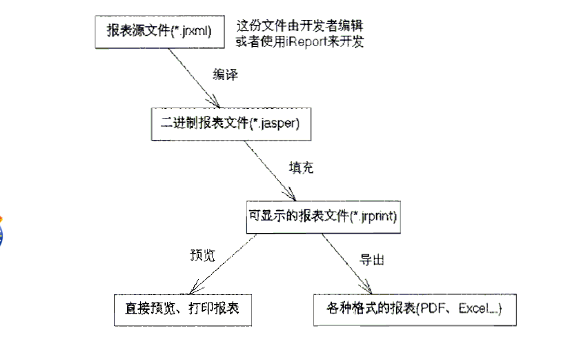
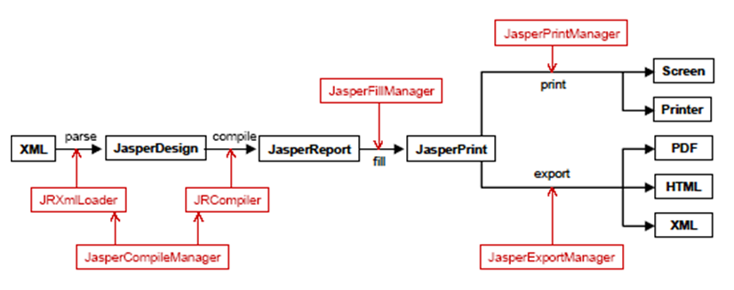
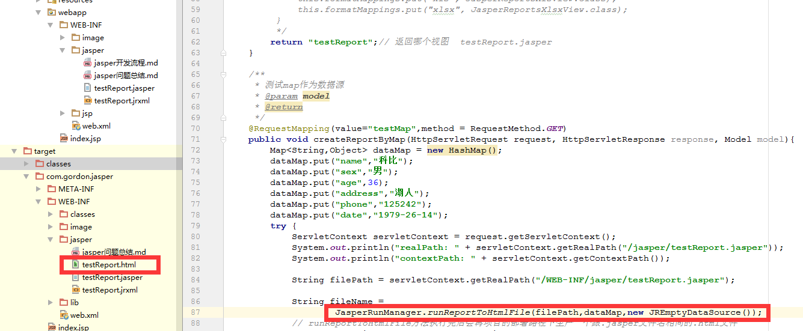

- 开发报表设计文件，也就是一个*.jrxml文件。可以有Ireport或Jaspersoft Studio来制作
- 使用JasperReports提供的JasperCompileManager工具编译*.jrxml文件，编译后生成一个*.jasper文件。可以有Ireport或Jaspersoft Studio来制作
-  使用JasperReports提供的JasperFillManager工具填充编译后的*.jasper文件，填充后生成一个*.jrprint文件。
- 使用导出管理器JasperExportManager或者各种格式的文件导出器JRXxxExporter将*.jrprint文件导出成各种格式的报表文件。也可以使用JRViewer工具类来直接浏览报表。也可以使用打印管理器JasperPrintManager来打印报表。

&nbsp;&nbsp;&nbsp;&nbsp;在JasperReports开发过程中，报表源文件开各种格式的报表文件要经过下图所示的过程：  
  
&nbsp;&nbsp;&nbsp;&nbsp;在JasperReports的开发流程中，JasperReports共涉及以下几个类：  


#### 相关类说明


###### net.sf.jasperreports.engine.design.JasperDesign
对应报表设计文件在内存中的形式，也就是对应的*.jrxml文件。

###### net.sf.jasperreports.engine.JasperReport
对应二进制报表文件在内存中的形式，也就是对应的*.jasper文件。

###### net.sf.jasperreports.engine.JasperPrint
对应可显示报表设计文件在内存中的形式，也就是对应的*.jrprint文件。这时可以通过JasperReports内建的报表查看器直接使用，也可以序列化后存储到磁盘上以后使用，更甚于通过网络发送给他处使用。

###### net.sf.jasperreports.engine.xml.JRXmlLoader
当调用这个方法来载入一个对象时，程序会先通过一个有效的URL来解析路径。如果失败了，程序就会认为这是一个文件路径并且尝试去读取。如果这个文件也没有被发现，程序就会尝试在classpath里寻找能够匹配的资源。如果这也失败了，只好抛出异常。
```
JasperDesign design = JRXmlLoader.load(File file);
JasperDesign design = JRXmlLoader.load(InputStreaminputStream);
JasperDesign design = JRXmlLoader.load(String sourceFileName);
```

###### net.sf.jasperreports.engine.JasperCompileManager
这是一个与编译有关的类，利用它提供的一些编译方法，允许我们将一个报表设计文档（*.jrxml文件）编译成一个二进制文件（*.jasper文件）。
此外，它也可以直接将net.sf.jasperreports.engine.design.JasperDesign（*.jrxml文件在内存中的形式）
对象编译成net.sf.jasperreports.engine.JasperReport对象。
```
    JasperCompileManager.compileReport(InputStream inputStream);    return JasperReport
    JasperCompileManager.compileReport(JasperDesign jasperDesign);  return JasperReport
    JasperCompileManager.compileReport(String sourceFileName);      return JasperReport
 
    JasperCompileManager.compileReportToFile(JasperDesign jasperDesign, String destFileName);
    JasperCompileManager.compileReportToFile(String sourceFileName);
    JasperCompileManager.compileReportToFile(String sourceFileName, String destFileName).
 
    JasperCompileManager.compileReportToStream(InputStream inputStream, OutputStream outputStream);
    JasperCompileManager.compileReportToStream(JasperDesign jasperDesign, OutputStream outputStream);
```


###### net.sf.jasperreports.engine.JasperFillManager
这个类用于报表填充的。报表填充就是为报表的数据查询提供数据库连接，给报表的参数设置值等。填充之前是*.jasper文件，经过填充后就变成了*.jrprint文件--这是一个可显示或者可导出成报表的文件。
参数的值通常通过一个java.util.Map对象来提供，这个Map对象的键是报表参数的名字。
数据源在不同的情况下可以通过两种方式提供：通常情况下，它必须作为一个JRDataSource对象被提供。但是由于大多数的报表所填的值都是从关系数据库取出来的。JasperReports有一个内建的默认行为，可以让人们在报表设计的时候就指定一条SQL查询语句。当在运行时填充报表的时候，执行SQL查询语句来获得需要填充的值。在这种情况下，JasperReports需要的仅仅是一个java.sql.Connection对象，一个通常的数据源对象的实例。JasperReports需要使用这个连接对象通过JDBC连接到关系数据库管理系统，并且执行报表查询。
在执行了报表查询后，JasperReports会自动创建一个net.sf.jasperreports.engine.JRResultSetDataSource对象来封装java.sql.ResultSet对象，并将它传给普通的填充过程使用。
```
    JasperFillManager.fillReport(InputStream inputStream, Map parameters);         return JasperPrint
    JasperFillManager.fillReport(InputStream inputStream, Map parameters, Connection connection);
    JasperFillManager.fillReport(InputStream inputStream, Map parameters, JRDataSource dataSource);
    JasperFillManager.fillReport(JasperReport jasperReport, Map parameters);   
    JasperFillManager.fillReport(JasperReport jasperReport, Map parameters, Connection connection);
    JasperFillManager.fillReport(JasperReport jasperReport, Map parameters, JRDataSource dataSource);
    JasperFillManager.fillReport(String sourceFileName, Map parameters);                  
    JasperFillManager.fillReport(String sourceFileName, Map parameters, Connection connection);
    JasperFillManager.fillReport(String sourceFileName, Map parameters, JRDataSource dataSource);
    
    JasperFillManager.fillReportToFile(JasperReport jasperReport, String destFileName, Map parameters);
    JasperFillManager.fillReportToFile(JasperReport jasperReport, String destFileName, Map parameters, Connection connection);
    JasperFillManager.fillReportToFile(JasperReport jasperReport, String destFileName, Map parameters, JRDataSource datasource);
    JasperFillManager.fillReportToFile(String sourceFileName, Map parameters);
    JasperFillManager.fillReportToFile(String sourceFileName, Map parameters, Connection connection);
    JasperFillManager.fillReportToFile(String sourceFileName, Map parameters, JRDatasource dataSource);
    JasperFillManager.fillReportToFile(String sourceFileName, String destFileName, Map parameters);
    JasperFillManager.fillReportToFile(String sourceFileName, String destFileName, Map parameters, Connection connection);
    JasperFillManager.fillReportToFile(String sourceFileName, String destFileName, Map parameters, JRDataSource dataSource);
    
    JasperFillManager.fillReportToStream(InputStream inputStream, OutputStream outputStream, Map parameters);
    JasperFillManager.fillReportToStream(InputStream inputStream, OutputStream outputStream, Map parameters, Connection connection);
    JasperFillManager.fillReportToStream(InputStream inputStream, OutputStream outputStream, Map parameters, JRDataSource dataSource);
    JasperFillManager.fillReportToStream(JasperReport jasperReport, OutputStream outputStream, Map parameters);
    JasperFillManager.fillReportToStream(JasperReport jasperReport, OutputStream outputStream, Map parameters, Connection connection);
    JasperFillManager.fillReportToStream(JasperReport jasperReport, OutputStream outputStream, Map parameters, JRDataSource dataSource);
```


###### net.sf.jasperreports.engine.JasperPrintManager
用于将一个*.jrprint文件完成打印。在JapserReports中，我们可以通过这个类来打印报表，它包含了所有的打印功能。它提供了打印整个文档或者部分文档、显不显示打印对话框的方法。使用这个类可以将JasperReports文档的一页作为一个java.awt.Image对象来显示。
```
    JasperPrintManager.printPage(InputStream inputStream, int pageIndex, boolean withPrintDialog);
    JasperPrintManager.printPage(JasperPrint jasperPrint, int pageIndex, boolean withPrintDialog);
    JasperPrintManager.printPage(String sourceFileName, int pageIndex, boolean withPrintDialog);     
    
    JasperPrintManager.printPages(InputStream inputStream, int firstPageIndex, int lastPageIndex, boolean withPrintDialog);          
    JasperPrintManager.printPages(JasperPrint jasperPrint, int firstPageIndex, int lastPageIndex, boolean withPrintDialog);          
    JasperPrintManager.printPages(String sourceFileName, int firstPageIndex, int lastPageIndex, boolean withPrintDialog);   
    
    JasperPrintManager.printPageToImage(InputStream inputStream, int pageIndex, float zoom);         
    JasperPrintManager.printPageToImage(JasperPrint jasperPrint, int pageIndex, float zoom);        
    JasperPrintManager.printPageToImage(String sourceFileName, int pageIndex, float zoom);  
    
    JasperPrintManager.printReport(InputStream inputStream, boolean withPrintDialog);         
    JasperPrintManager.printReport(JasperPrint jasperPrint, boolean withPrintDialog);        
    JasperPrintManager.printReport(String sourceFileName, boolean withPrintDialog);
    
    JasperPrintManager.printReportToPdf(JasperPrint jasperPrint);
    JasperPrintManager.printReportToPdfFile(JasperPrint jasperPrint, String destFileName);
    JasperPrintManager.printReportToPdfFile(String sourceFileName);
    JasperPrintManager.printReportToPdfFile(String sourceFileName, String destFileName);
    JasperPrintManager.printReportToPdfStream(InputStream inputStream, OutputStream outputStream);
    JasperPrintManager.printReportToPdfStream(JasperPrint jasperPrint, OutputStream outputStream);
    
    JasperPrintManager.printReportToXml(JasperPrint jasperPrint);
    JasperPrintManager.printReportToXmlFile(JasperPrint jasperPrint, String destFileName);
    JasperPrintManager.printReportToXmlFile(String sourceFileName);
    JasperPrintManager.printReportToXmlFile(String sourceFileName, String destFileName);
    JasperPrintManager.printReportToXmlStream(InputStream inputStream, OutputStream outputStream);
    JasperPrintManager.printReportToXmlStream(JasperPrint jasperPrint, OutputStream outputStream);
```

###### net.sf.jasperreports.engine.JasperExportManager
这个管理类对不同来源和不同去处（文件、输入输出流等）的数据提供不同的方法。用于将可显示的报表导出成各种格式的报表文件，例如PDF、HTML、XML和其他的格式。
```
    JasperExportManager.exportReportToHtmlFile(JasperPrint jasperPrint, String destFileName);
    JasperExportManager.exportReportToHtmlFile(String sourceFileName);
    JasperExportManager.exportReportToHtmlFile(String sourceFileName, String destFileName);
    
    JasperExportManager.exportReportToPdf(JasperPrint jasperPrint);
    JasperExportManager.exportReportToPdfFile(JasperPrint jasperPrint, String destFileName);
    JasperExportManager.exportReportToPdfFile(String sourceFileName);
    JasperExportManager.exportReportToPdfFile(String sourceFileName, String destFileName);
    JasperExportManager.exportReportToPdfStream(InputStream inputStream, OutputStream outputStream);
    JasperExportManager.exportReportToPdfStream(JasperPrint jasperPrint, OutputStream outputStream);
    
    JasperExportManager.exportReportToXml(JasperPrint jasperPrint);
    JasperExportManager.exportReportToXmlFile(JasperPrint jasperPrint, String destFileName, boolean isEmbeddingImages);
    JasperExportManager.exportReportToXmlFile(String sourceFileName, boolean isEmbeddingImages);
    JasperExportManager.exportReportToXmlFile(String sourceFileName, String destFileName, boolean isEmbeddingImages);
    JasperExportManager.exportReportToXmlStream(InputStream inputStream, OutputStream outputStream);
    JasperExportManager.exportReportToXmlStream(JasperPrint jasperPrint, OutputStream outputStream);
```

###### net.sf.jasperreports.engine.export.JRXxxExporter
这是一系列的文件导出器，它们用于将*.jrprint文件导出成对应格式的报表文件。例如XSL、PDF、HTML、XML、CSV、RTF、TXT和其他的格式。JRXlsExporter、JRPdfExporter、JRXmlExporter、JRCsvExporter、JRHtmlExporter、JRTextExporter、JRRtfExporter
```
    eg: JRXlsExporter exporter = new JRXlsExporter();
        exporter.setParameter(JRExporterParameter.JASPER_PRINT, jasperPrint);
        exporter.setParameter(JRExporterParameter.OUTPUT_FILE_NAME, "reports/StretchReport.xls");
        exporter.setParameter(JRXlsExporterParameter.IS_ONE_PAGE_PER_SHEET, Boolean.TRUE);
        exporter.exportReport();
```

###### net.sf.jasperreports.engine.JasperRunManager
这个类可以直接将*.jasper文件导出成各种格式的报表文件，有时候在报表填充过程中我们不希望生成中间的net.sf.jasperreports.engine.JasperPrint对象，而直接生成我们所需要的文档格式，例如：PDF或HTML。
```
    JasperRunManager.runReportToHtmlFile(String sourceFileName, Map parameters);
    JasperRunManager.runReportToHtmlFile(String sourceFileName, Map parameters, Connection conn);
    JasperRunManager.runReportToHtmlFile(String sourceFileName, Map parameters, JRDataSource jrDataSource);
    JasperRunManager.runReportToHtmlFile(String sourceFileName, String destFileName, Map parameters);
    JasperRunManager.runReportToHtmlFile(String sourceFileName, String destFileName, Map parameters, Connection conn);
    JasperRunManager.runReportToHtmlFile(String sourceFileName, String destFileName, Map parameters, JRDataSource jrDataSource);
    
    JasperRunManager.runReportToPdf(InputStream inputStream, Map parameters);
    JasperRunManager.runReportToPdf(InputStream inputStream, Map parameters, Connection conn);
    JasperRunManager.runReportToPdf(InputStream inputStream, Map parameters, JRDataSource jrDataSource);
    JasperRunManager.runReportToPdf(JasperReport jasperReport, Map parameters);
    JasperRunManager.runReportToPdf(JasperReport jasperReport, Map parameters, Connection conn);
    JasperRunManager.runReportToPdf(JasperReport jasperReport, Map parameters, JRDataSource jrDataSource);
    JasperRunManager.runReportToPdf(String sourceFileName, Map parameters);
    JasperRunManager.runReportToPdf(String sourceFileName, Map parameters, Connection conn);
    JasperRunManager.runReportToPdf(String sourceFileName, Map parameters, JRDataSource jrDataSource);
    
    JasperRunManager.runReportToPdfFile(String sourceFileName, Map parameters);
    JasperRunManager.runReportToPdfFile(String sourceFileName, Map parameters, Connection conn);
    JasperRunManager.runReportToPdfFile(String sourceFileName, Map parameters, JRDataSource jrDataSource);
    JasperRunManager.runReportToPdfFile(String sourceFileName, String destFileName, Map parameters);
    JasperRunManager.runReportToPdfFile(String sourceFileName, String destFileName, Map parameters, Connection conn);
    JasperRunManager.runReportToPdfFile(String sourceFileName, String destFileName, Map parameters, JRDataSource jrDataSource);
    
    JasperRunManager.runReportToPdfStream(InputStream inputStream, OutputStream outputStream, Map parameters);
    JasperRunManager.runReportToPdfStream(InputStream inputStream, OutputStream outputStream, Map parameters, Connection conn);
    JasperRunManager.runReportToPdfStream(InputStream inputStream, OutputStream outputStream, Map parameters, JRDataSource jrDataSource);
```
<b>需要注意的是</b>：

&nbsp;&nbsp;&nbsp;&nbsp;1、生成的文件名和对应的*.jrxml文件名相同  
&nbsp;&nbsp;&nbsp;&nbsp;2、生成的文件路径和对应的*.jrxml文件部署后所在目录相同  


###### net.sf.jasperreports.engine.JRDataSource
JasperReports在报表数据来源方面是具有高柔韧性的。人们可以使用任意的数据源，前提条件就是能够提供一个这个接口的恰当的实现。这样报表引擎可以在填充报表时从数据源解析和检索数据。
通常来说，如果一个报表填充了数据，肯定有一个这个接口的实例被报表引擎提供或创建。

###### net.sf.jasperreports.engine.JREmptyDataSource
作为最简单的net.sf.jasperreports.engine.JRDataSource接口的实现，这个类可以在不希望显示从数据源获得的数据，而只关心数据源的虚拟行数时在报表中使用。
在提供的例子里有不少在填充报表时用到了这个类的实例，例如：fonts、images、shapes和unicode。这样做是为了模拟一个有一条空记录的数据源。

###### net.sf.jasperreports.engine.JRResultSetDataSource
这个类是net.sf.jasperreports.engine.JRDataSource接口的一个默认实现。由于大多数的报表都由关系数据库的数据生成，JasperReports包含了一个封装了java.sql.ResultSet对象的默认实现。
这个类有着明确的目的：在传给报表填充测试之前封装已经载入的数据集。在执行了通过JDBC的报表查询后它会被用来封装从数据库获得的数据。

###### net.sf.jasperreports.engine.data.JRTableModelDataSource
这个类是net.sf.jasperreports.engine.JRDataSource接口的另外一个默认实现。它封装了javax.swing.table.TableModel对象。它可以在Java Swing应用程序中通过已经载入的屏幕表格的数据生成报表。

###### net.sf.jasperreports.engine.data.JRBeanCollectionDataSource
使用Bean作为数据源，JRBeanCollectionDataSource继承JRAbstractBeanDataSource类，而JRAbstractBeanDataSource是一个抽象类它间接的实现了JRDataSource这个接口，所以我们就可以不用自己去实现next()/getFieldValue()这两个方法了
```
eg：JRDataSource datesource = new JRBeanCollectionDataSource(list);
```

###### net.sf.jasperreports.swing.JRViewer
这个类和上面说到的类不大一样，说它是一个实用类不如说是一个显示插件。它可以用在基于Swing的应用程序里来显示JasperReports生成的报表。
这个可视化组件并不能满足每一个人。它被当作一个例子组件被包含在主类库中，用来显示核心打印功能可以在基于Swing的应用程序里通过net.sf.jasperreports.engine.JasperPrintManager类生成java.awt.Image对象来显示报表。
如果想修改这个组件使其满足应用程序的需求，首选的方法是使用它的子类。
```
    JRVierer jr = new JRViewer(InputStream inputStream, boolean isXML);
    JRVierer jr = new JRViewer(inputStream inputStream, boolean isXML, Locale locale);
    JRVierer jr = new JRViewer(inputStream inputStream, boolean isXML, Locale locale, ResourceBundle resBundle);
 
    JRVierer jr = new JRViewer(JasperPrint jrPrint);
    JRVierer jr = new JRViewer(JasperPrint jrPrint, Locale locale);
    JRVierer jr = new JRViewer(JasperPrint jrPrint, Locale locale, ResourceBundle resBundle);
    
    JRVierer jr = new JRViewer(String fileName, boolean isXML);
    JRVierer jr = new JRViewer(String fileName, boolean isXML, Locale locale);
    JRVierer jr = new JRViewer(String fileName, boolean isXML, Locale locale, ResourceBundle resBundle);
```

###### net.sf.jasperreports.view.JasperViewer
这也是一个以教学为目的的类。它使用了net.sf.jasperreports.swing.JRViewer组件来显示报表。它是一个简单的Java Swing应用程序，可以装载和显示报表。它在提供的例子中被广泛的使用，用来显示生成的文档。

###### net.sf.jasperreports.view.JasperDesignViewer
通常，一个使用JasperReports来生成报表的应用程序如果使用了这个类将不能运行。这个类可以在设计阶段用来预览报表模版。它被当作一个用作可视化设计而使用的开发工具提供。

###### net.sf.jasperreports.engine.JRAbstractScriptlet
脚本程序(Scriptlets)是JasperReports类库中一个非常强大的功能。它可以让用户自己编写在填充过程中可以被报表引擎执行的代码。用户代码可以在一个定义良好的片断（例如：页、列或者组）里操作报表数据；为生成的文档建立一个新的range。

###### net.sf.jasperreports.engine.JRDefaultScriptlet
这是net.sf.jasperreports.engine.JRAbstractScriptlet的一个便利的子类。大多数时间用户在使用脚本程序时会选择这个类，这样他们就不需要实现抽象类里定义的所有抽象方法了。

##### 附：Exporter常用参数说明
```
Ø         net.sf.jasperreports.engine.JRExporterParameter. JASPER_PRINT
这个参数是net.sf.jasperreports.engine.JasperPrint的对象，exporter在导出报表前会做检测  
 
Ø         net.sf.jasperreports.engine.JRExporterParameter. JASPER_PRINT_LIST
这个参数是包含了n个net.sf.jasperreports.engine.JasperPrint对象的java.util.List，exporter在导出报表前会做检测
 
Ø         net.sf.jasperreports.engine.JRExporterParameter.INPUT_STREAM
这个参数是net.sf.jasperreports.engine.JasperPrint被序列化对象的输入流，exporter在导出报表前会做检测
 
Ø         net.sf.jasperreports.engine.JRExporterParameter.INPUT_URL
这个参数是包含net.sf.jasperreports.engine.JasperPrint被序列化对象的URL，exporter在导出报表前会做检测
 
Ø         net.sf.jasperreports.engine.JRExporterParameter.INPUT_FILE_NAME
这个参数是存储了net.sf.jasperreports.engine.JasperPrint被序列化对象的文件路径，exporter在导出报表前会做检测
注意：以上几个参数不能全部为空
 
Ø         net.sf.jasperreports.engine.JRExporterParameter.OUTPUT_STRING_BUFFER
这个参数是java.lang.StringBuffer的对象，存储已经产生出的指定格式报表的内容
 
Ø         net.sf.jasperreports.engine.JRExporterParameter.OUTPUT_WRITER
这个参数是java.io.Writer的对象，将指定格式报表的内容发送到一个字符流，例如Servlet的PrintWriter
 
Ø         net.sf.jasperreports.engine.JRExporterParameter.OUTPUT_STREAM
这个参数是java.io.OutputStream的对象，将指定格式报表的内容发送到一个输出流，例如ServletOutputStream
 
Ø         net.sf.jasperreports.engine.JRExporterParameter.OUTPUT_FILE
这个参数是java.io.FILE的对象，将指定格式报表的内容存储到文件里面
 
Ø         net.sf.jasperreports.engine.JRExporterParameter.OUTPUT_FILE_NAME
这个参数是java.lang.String的对象，将指定格式报表的内容存储到文件里面
 
Ø         net.sf.jasperreports.engine.JRExporterParameter.CHARACTER_ENCODING
这个参数是java.lang.String的对象，指定格式报表的内容编码
 
Ø         net.sf.jasperreports.engine.JExcelApiExporterParameter.IS_FONT_SIZE_FIX_ENABLED
这个参数是java.lang.Boolean的对象，是否允许自动修正Excel每个栏位的大小  
 
Ø         net.sf.jasperreports.engine.JRXlsExporterParameter.IS_ONE_PAGE_PER_SHEET
这个参数是java.lang.Boolean的对象，每一页是否用一个Sheet  
 
Ø         net.sf.jasperreports.engine.JRXlsExporterParameter. IS_REMOVE_EMPTY_SPACE_BETWEEN_ROWS
这个参数是java.lang.Boolean的对象，是否移除行与行之间的空行  
 
Ø         net.sf.jasperreports.engine.JRXlsExporterParameter.IS_WHITE_PAGE_BACKGROUND
这个参数是java.lang.Boolean的对象，页面的背景是否为白的
 
Ø         net.sf.jasperreports.engine.JRXlsExporterParameter.SHEET_NAMES
这个参数是java.lang.String的对象，Sheet的名字
 
Ø         net.sf.jasperreports.engine.JRCsvExporterParameter.FIELD_DELIMITER
这个参数是java.lang.String的对象，栏位之间的分隔符
 
Ø         net.sf.jasperreports.engine.JRCsvExporterParameter.RECORD_DELIMITER
这个参数是java.lang.String的对象，栏位之间的分隔符
 
Ø         net.sf.jasperreports.engine.JRHtmlExporterParameter.IS_OUTPUT_IMAGES_TO_DIR
这个参数是java.lang.Boolean的对象，是否输出图片到目录  
 
Ø         net.sf.jasperreports.engine.JRHtmlExporterParameter.IMAGES_DIR_NAME
这个参数是java.lang.String的对象，图片目录的绝对路径  
 
Ø         net.sf.jasperreports.engine.JRHtmlExporterParameter.IMAGES_DIR
这个参数是java.io.File的对象，图片目录
 
Ø         net.sf.jasperreports.engine.JRHtmlExporterParameter.IMAGES_URI
这个参数是java.lang.String的对象，通过Web访问时图片的URI
```

