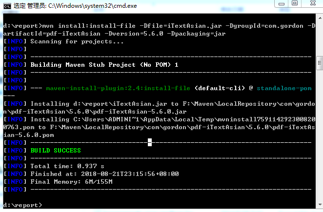
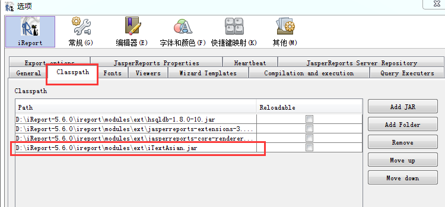
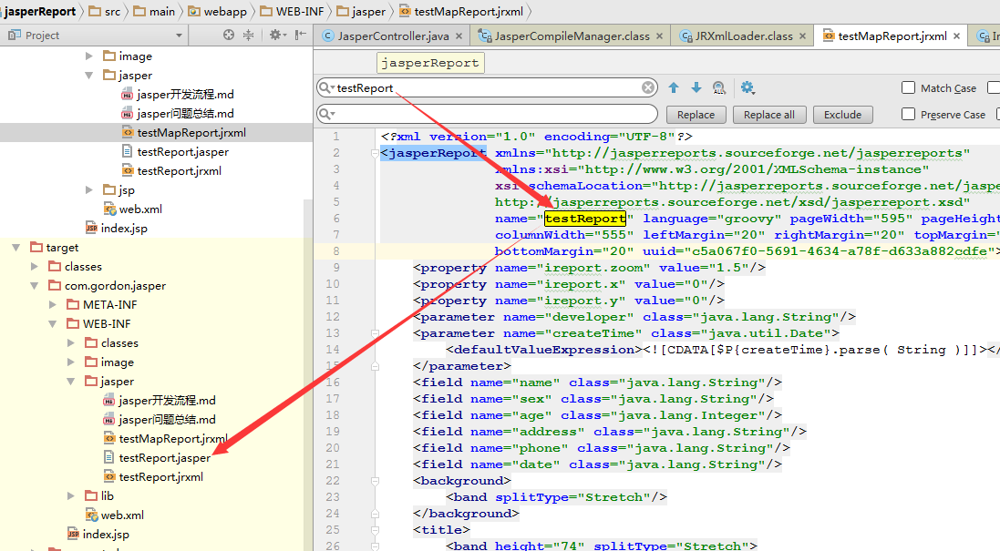
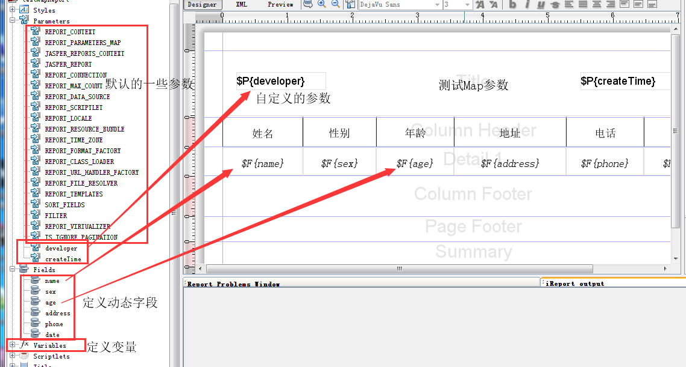
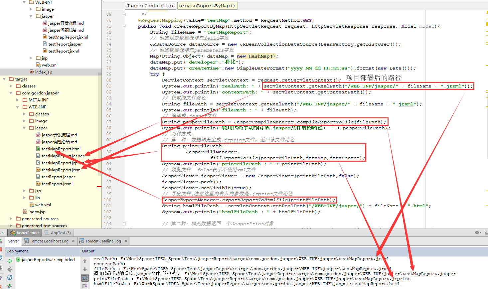
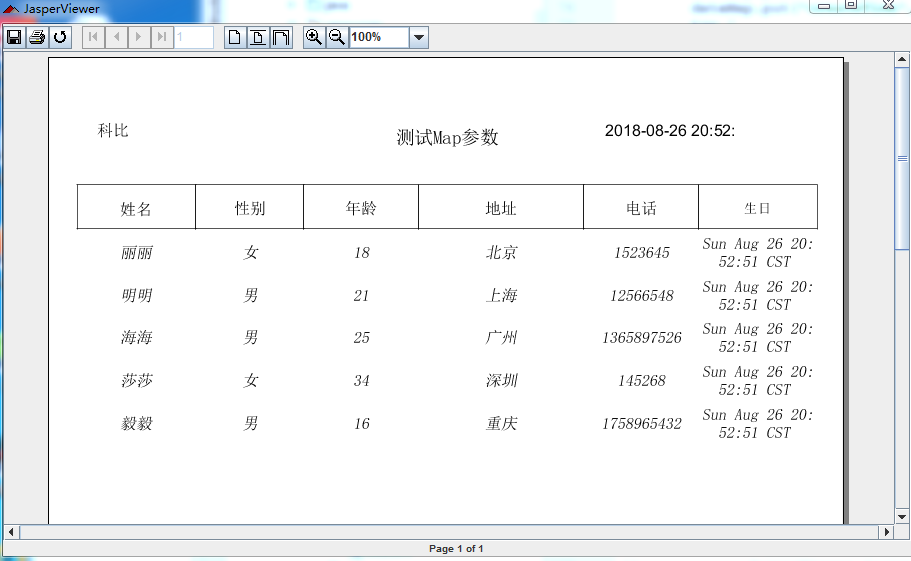

#### IREPORT软件制作.jasper文件时注意事项
&nbsp;&nbsp;&nbsp;&nbsp;Page Header区域是放置有哪些列，列名是什么。设计时一定要确保
列的高度和Page Header区域的高度一致。  
&nbsp;&nbsp;&nbsp;&nbsp;Detail 1区域是放置列的值，里面用动态字段表示。设计时一定要确保
列的高度和Detail 1区域的高度一致。否则编译不通过，还有可能无法循环打印出多条数据。

#### jasper打印时到底是用那个文件
**&nbsp;&nbsp;&nbsp;&nbsp;.jrxml和.jasper文件的区别**：  
&nbsp;&nbsp;&nbsp;&nbsp;  .jrxml是源文件，里面定义一系列的标签用于封装数据视图结构，
就像一个HTML文件，但区别于HTML文件的是他不能在浏览器中预览。  
&nbsp;&nbsp;&nbsp;&nbsp;  .jasper是将.jrxml文件翻译后的文件，也是项目中真正用到的文件，
如果只用.jrxml文件还需在项目中调用jasper提供的类方法翻译成.jasper文件

#### pdf打印时中文页面报错
&nbsp;&nbsp;&nbsp;&nbsp;  网上都说是jar包问题，确实是，但不需要像网上说的那样去重新编译jar包，
只需将安装ireport软件中D:\iReport-5.6.0\ireport\modules\ext\iTextAsian.jar添加到项目中，
并且添加到ireport的classpath中，重启ireport软件，最后重新编译出.jasper文件放入项目中，重启服务即可。

#### maven方式将iTextAsian.jar打入到本地仓库
&nbsp;&nbsp;&nbsp;&nbsp;  先将jar包放到一个比较方便的位置，免得cd时多打字，呵呵。

&nbsp;&nbsp;&nbsp;&nbsp;  比如：d:\report>mvn install:install-file -Dfile=iTextAsian.jar -DgroupId=com.gordon
-DartifactId=pdf-iTextAsian -Dversion=5.6.0 -Dpackagin=jar


```
<!--导出pdf中文显示依赖-->
<dependency>
      <groupId>com.gordon</groupId>
      <artifactId>pdf-iTextAsian</artifactId>
      <version>5.6.0</version>
</dependency>
```


#### 解决项目启动报错但却没有详细信息
在resource目录下新建logging.properties并加入如下代码，tomcat就会打印出详细信息

```
handlers = org.apache.juli.FileHandler, java.util.logging.ConsoleHandler

############################################################
# Handler specific properties.
# Describes specific configuration info for Handlers.
############################################################

org.apache.juli.FileHandler.level = FINE
org.apache.juli.FileHandler.directory = ${catalina.base}/logs
org.apache.juli.FileHandler.prefix = error-debug.

java.util.logging.ConsoleHandler.level = FINE
java.util.logging.ConsoleHandler.formatter = java.util.logging.SimpleFormatter
```
#### 解决JasperFillManager生成.jasper文件与.jrxml文件名不同
&nbsp;&nbsp;&nbsp;&nbsp; 由于偷懒将testReport.jrxml复制了一份，保存时重命名为testMapReport.jrxml。
正是这样才导致JasperCompileManager.compileReportToFile(filePath)生成.jasper文件时，文件名为testReport.jasper
为什么呢？查看源代码在生成文件时是去解析.jrxml文件，是从xml文件中去name值作为新文件的文件名。而我复制的，所以name值还是原来的那个。



#### 测试传入Map参数
&nbsp;&nbsp;&nbsp;&nbsp; 首先需要明确map参数对应jrxml文件中的哪些字段，在ireport软件中定义好paramters，如下图：



###### 开发代码


###### 结果



###### 第二种方式结果


